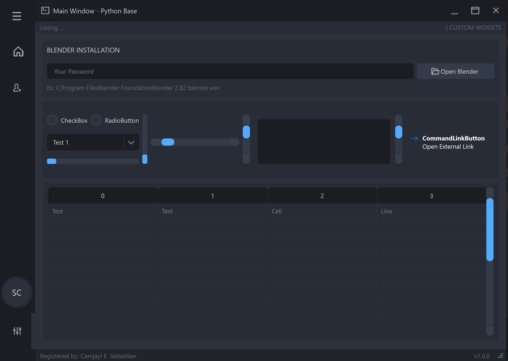
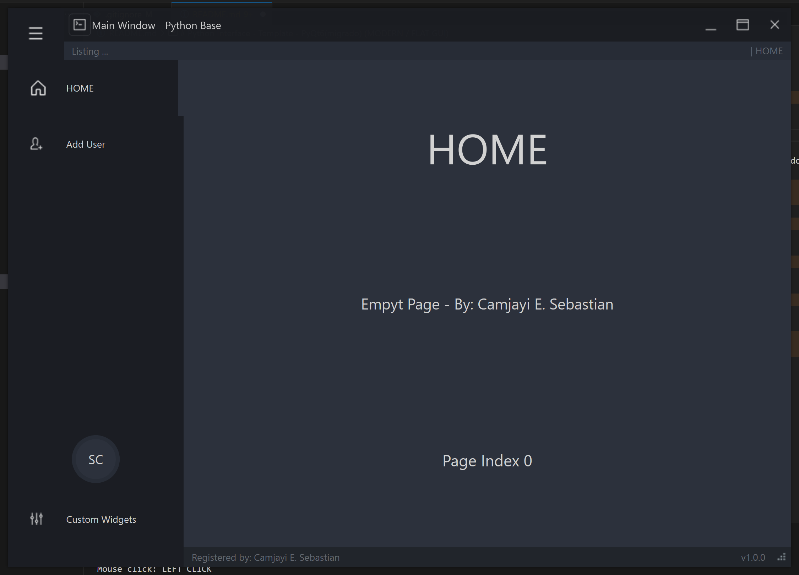
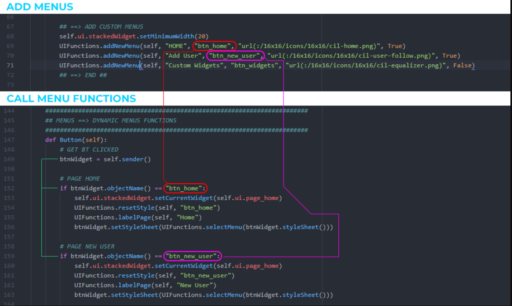

# UIXCore - Desk Template - PyQt6(Migrado) (MODERN / FLAT GUI)

> **Warning**: use PyQt6 > PyQt6-6.8.1 PyQt6-Qt6-6.8.2 PyQt6-sip-13.10.0 (**pip install PyQt6**)!





Proyecto creado utilizando Python, Qt Designer y PyQt6.
Espero que sea de ayuda para todos los que están comenzando en el mundo de Python.
Este proyecto funciona muy bien en Windows; sin embargo, en Linux y macOS hay algunos problemas con el tamaño de las fuentes y la barra de título personalizada no funciona correctamente.

## REQUERIMENTS

>
> ```sh
> python -m venv env
> .\env\Scripts\Activate
> pip install PyQt6
> ```
>

## RUN FILE

main.py

## ADD MENUS


